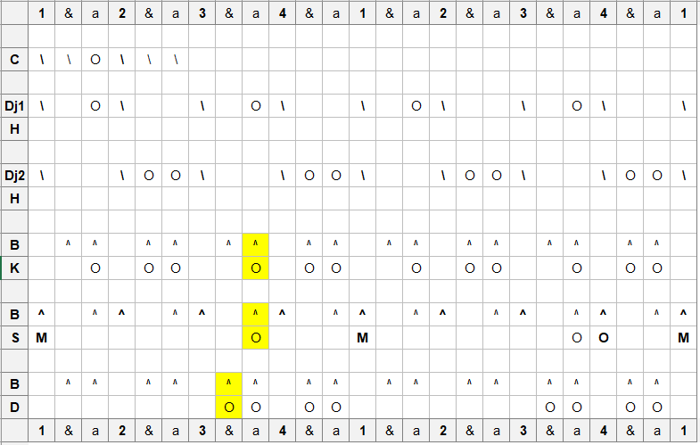

# Dunum Gbe

## Location
Kouroussa

## Ethnic group
Malinke

## Purpose
Dance of the strong men. The mother of all dunumba rhythms.

## Notation
```{r, echo=FALSE, fig.align='center', out.width="80%"}

```