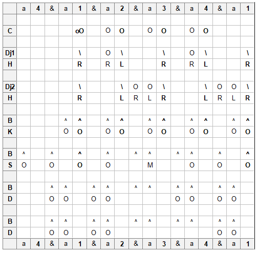
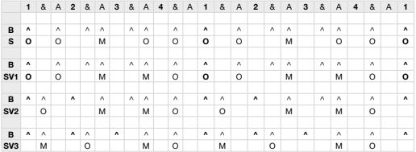

# Mendiani

## Location
Guinea

## Ethnic group
Malinke

## Purpose
Mendiani is an initiated dance for young girls between the ages of 8 and 12 who **must** be virgins. After Ramadan, they are carried out to the village bara on the shoulders of men, then they dance.

## Notation
```{r, echo=FALSE, fig.align='center', out.width="80%"}

```

### Sangban variations
```{r, echo=FALSE, fig.align='center', out.width="80%"}

```