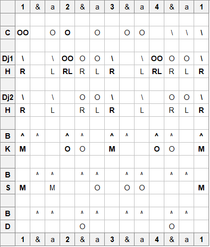

# Soboninkun

## Location
NE Guinea

## Ethnic group
Malinke

## Purpose
Sboninkun is a mask of a small animal head.

## Notation
Break and Dj2 4/4-feel.

Flam in Dj1 is "stretched."

```{r, echo=FALSE, fig.align='center', out.width="60%"}

```