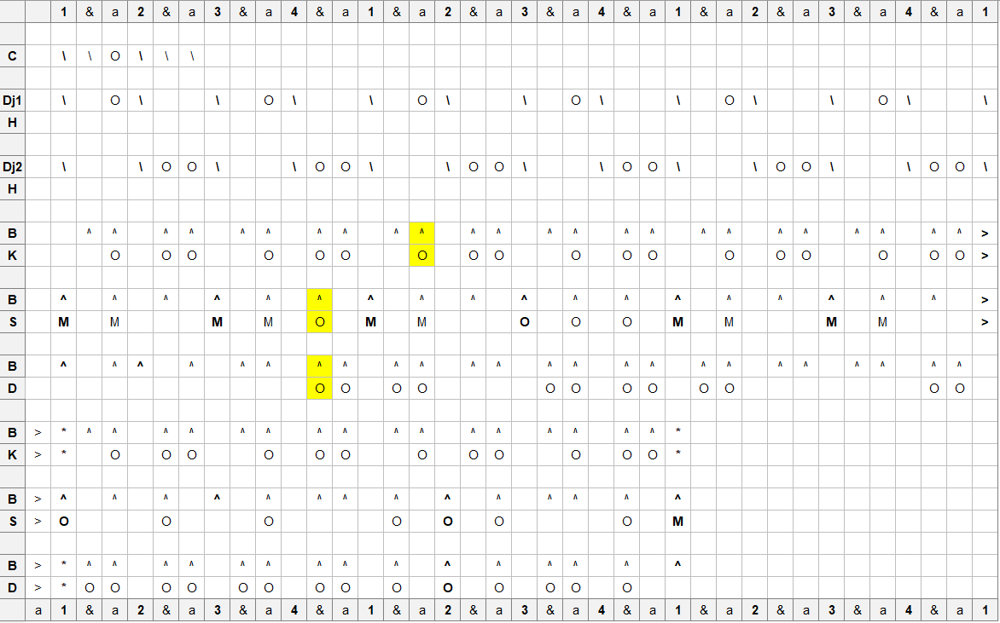

# Takosaba

## Location
Hamanah region

## Ethnic group
Malinke

## Purpose
Dunumba Family. Means "take three times", referring to the dance.

## Notation
```{r, echo=FALSE, fig.align='center', out.width="100%"}

```