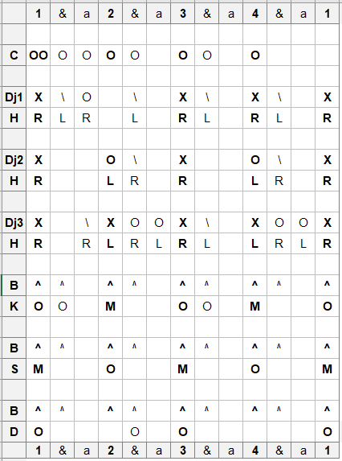

# Tiriba

## Location
NW Guinea

## Ethnic group
Landouma

## Purpose
Tiriba was once a costume worn by a tall dancer. Later it was played for girls initiation. Even later it was danced by women and their daughters.

## Notation
```{r, echo=FALSE, fig.align='center', out.width="60%"}

```